# *Tea Leave Classification Using Machine Learning Approaches*
Tool Used: Python ([Google Collab](https://colab.research.google.com/drive/1Esfj_Ye5NSQTp6VBU3D0H4ACgiFJ4XIn?usp=sharing))

Data Source and its Citation: Alam, B M Shahria; Ahammed, Fahad; Kibria, Golam; Noor, Mohammad Tahmid; Shikdar, Omar Faruq; Mahazabin, Kazi Isat; Ali, Md Nawab Yousuf (2025), “teaLeafBD”, Mendeley Data, V3, doi: [10.17632/744vznw5k2.3](https://data.mendeley.com/datasets/744vznw5k2/3)

## Project Summary
### Problem

Tea is the world’s most popular beverage, yet production is constantly threatened by disease. Traditional manual inspection is labor-intensive and prone to error. While Deep Learning (DL) were introduced to the solution, many models remain "black boxes," making it difficult for farmers to trust and adopt the technology.

### Solution

The research addresses both accuracy and interpretability. By utilizing the teaLeafBD dataset, I conducted a comparative analysis between traditional standalone Convolutional Neural Networks(CNNs) and hybrid architectures (CNN-Machine Learning(ML)). To ensure the models are trustworthy, I integrated Grad-CAM visualization to produce heatmaps that highlight exactly which leaf features the model is focusing on.

## Project Objectives
1.	To implement standalone CNN models and hybrid CNN-ML models on the images of tea leaves.
2.	To interpret the results from CNN models on tea leaves disease classification by using Gradient-weighted Class Activation Mapping (Grad-CAM).
3.	To compare the performance of CNN models and hybrid CNN-ML models on tea leaves disease classification using performance metrics.

## Research Framework and Methodology

The methodology for this study is structured into three distinct phases  (<b><i>data acquisition and data preparation, data modelling, and model interpretation and evaluation</i></b>), consisting of five core processes (<b><i>data collection, image preprocessing, model training among different pretrained CNN models and hybrid CNN-ML models, Grad-Cam visual interpretation, and model evaluation using performance metrices</i></b>) designed to optimize classification accuracy and model interpretability.

### Phase 1: Data Acquisition & Preparation
This phase focuses on building a robust foundation for the deep learning models.

* **Data collection**: Sourced the *teaLeafBD* dataset from Mendeley Data, consisting of six distinct tea leaf disease categories.
    * **Setting up binary scenario**: Combined all six distinct tea leaf disease categories into a single category "disease".
    * **Setting up multiclass scenario**: the same state of *teaLeafBD* dataset.
    * **Stratified Splitting**: Images were partitioned into **Training** (*70%*), **Validation** (*20%*), and **Testing** (*10%*) sets to ensure class balance across all subsets.
* **Image Preprocessing**: The images from **training set and validation set** undergone a series of image preprocessing to improve feature extraction efficiency during process of filtering under convolutional and pooling layers which are available in every pretrained CNN model, and to ensure consistency while reducing noise among the images. 
    * **Image Augmentation**: Applied to images from the **training set** during image preprocessing process. Notably, a subset of the ***original images without any augmentation applied was preserved*** for the model evaluation process to determine the performance improvement given by the process of image augmentation.

### Phase 2: Data Modelling
In this phase, two distinct architectural approaches were tested and optimized each in both binary and multiclass experimental scenario.

* **Standalone CNNs**: Pre-trained CNN (*VGG-16, MobileNetV2, EfficientNet_B1 and ResNet-50*) were trained and validated using the pre-processed validation set to prevent overfitting.

* **Hybrid CNN-ML Models**: Combined CNN feature extractors with ML classifiers (*SVM, RF and XGBoost*). These models underwent Hyperparameter Tuning via Randomized Search to ensure optimal performance.
  
### Phase 3: Model Evaluation and Interpretation

* **Grad-CAM**: Applied to standalone CNNs to generate heatmaps, providing a visual audit of the model's decision-making process.
* **Performance Metric**: Models were evaluated in both Binary and Multiclass scenarios using confusion matrix and performance metrics (*Accuracy, Recall, Precision and F1-score*).

Here is the research framework diagram:

  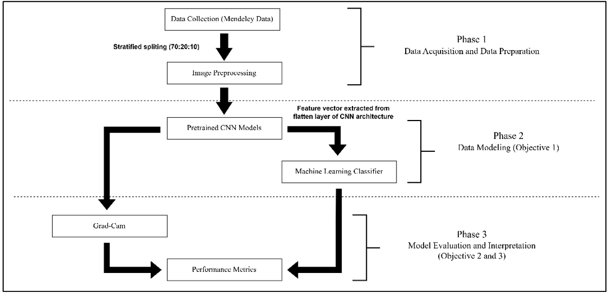
   

## Results and Discussion
The results are break into two different experiment scenario (**binary and multiclass**). A total of 32 distinct model configurations were utilised in binary and multiclass experiment scenario.

The models were built by combining three key components:
1. **4 CNN Pre-trained Feature Extractors**: *VGG-16, MobileNetV2, EfficientNet_B1 and ResNet-50*

2. **4 Decision-Making Algorithms**: Standard CNN classifier (*SoftMax*)  and three ML Classifiers (*SVM, RF and XGBoost*)

3. **2 Training Regimes**: Models were trained on both Original Images and Augmented Images to quantify the impact of data augmentation on performance.

### Grad-Cam Visual (Binary)

#### Disease

Observation:
*  Necrosis, torn edges and presence of lesion on the leaf surface.
*  Non-green colour

Original Image:

  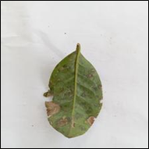
   

Results:

  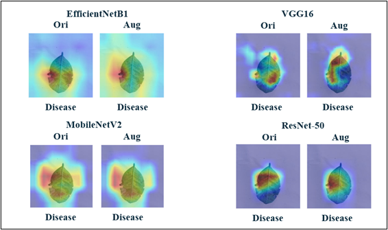
   

* All models accurately highlight the torn edges and necrotic brown patches on the surface of leaf.
  
#### Healthy

Observation:
*  No sign of necrosis, bite of pest and lesion at the surface of tea leaf
*  Green colour

Original Image:

  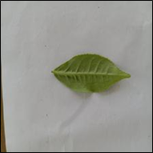
   

Results:

  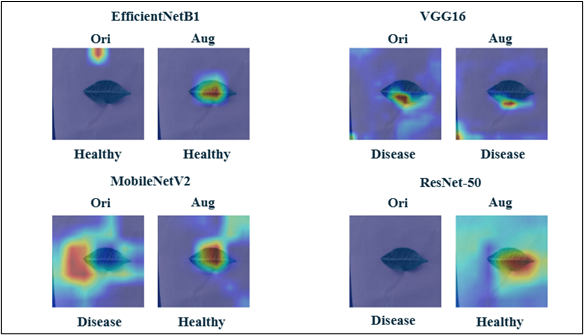

* For **MobileNetV2 and ResNet-50**, augmentation was the key to success; it corrected initial failures (such as focusing on background noise or failing to extract features) by successfully shifting the models' focus toward the leaf body.

* **VGG-16** consistently failed regardless of augmentation, as it remained fixated on leaf edges rather than the bright green leaf surface, leading to continued misclassification of healthy leaves as diseased.
  

### Model Evaluation (Binary)

  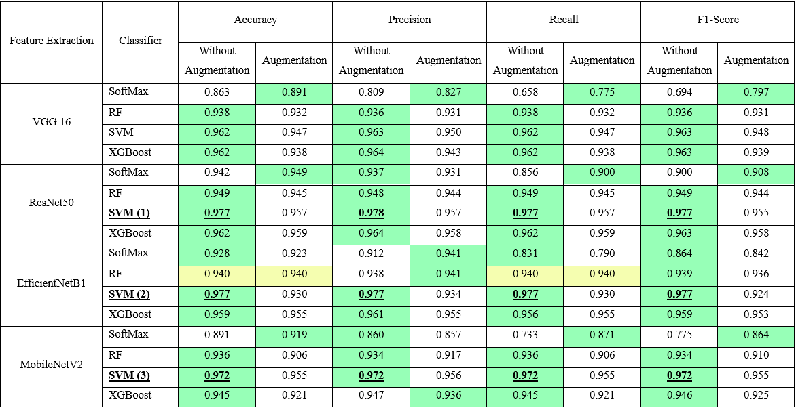

* While standard **CNNs (SoftMax)** relied heavily on image augmentation to improve, the **Hybrid CNN-SVM** models proved to be naturally superior at extracting critical features. In fact, these hybrids performed best using only the original images, demonstrating that they can achieve elite results without the extra step of data augmentation.
* To avoid being misled by our imbalanced dataset, we focused on the F1-score rather than accuracy. This led us to our three top-performing models: ***ResNet-50-SVM (0.977), EfficientNetB1-SVM (0.977), and MobileNetV2-SVM (0.972)***, all of which delivered their best performance when trained on the original, non-augmented data.
  
### Grad-Cam Visual (Multiclass)

#### Tea Algal Leaf Spot
Observation:
*  Leaf shrinking and yellowing
*  Irregular lesions - dark brown edges
  
Original Image:

  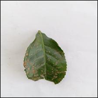
   

Results:

  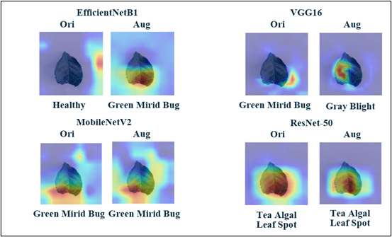
   

* Only the **ResNet-50** models (both original and augmented) successfully identified the disease by correctly focusing on the circular brown spots, whereas other models were often distracted by leaf edges, causing them to confuse the lesions with Green Mirid Bug bites.
* Model errors were driven by different factors: **EfficientNetB1** was misled by background noise, while VGG-16 failed to recognize the disease type despite correctly highlighting the brown spots, and several other architectures struggled to distinguish between the physical symptoms of different diseases.

#### Brown Blight
Observation:
*  Small spots (Transition from brown to black)
*  Necrotic patch

Original Image:

  
   

Results:

  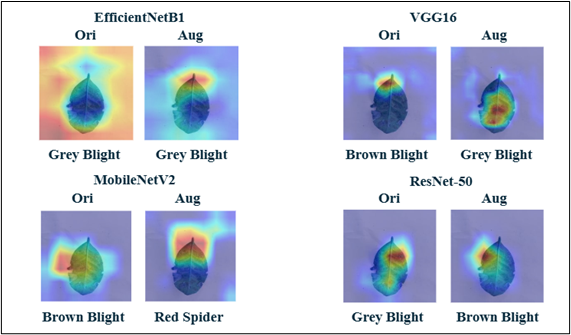
   

* Most standalone models struggled to distinguish between Brown and Grey Blight due to their subtle color transitions. Models like **EfficientNetB1** failed because their attention was diverted to background noise or healthy stems, while **VGG-16** and **MobileNetV2** interestingly performed better in their original versions by correctly localizing necrotic areas before augmentation shifted their focus away from the lesions.
* Unlike the other architectures, ResNet-50 showed a clear benefit from image augmentation; it shifted from a misclassification on original images to a correct identification of Brown Blight by accurately capturing small necrotic patches and withered leaf edges that it had previously overlooked.

#### Grey Blight
Observation:
*  Small spots (Transition from grey to brown)
*  Necrotic patch
  
Original Image:

  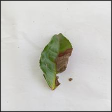
   

Results:

  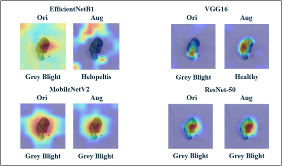
   

* Most standalone CNN models accurately identified Grey Blight by successfully localizing the critical diagnostic features—specifically the greyish lesions and withered sections on the right side of the leaf.
* In contrast, image augmentation actually hindered **EfficientNetB1** and **VGG-16**; the former was distracted by background noise (misclassifying the sample as Helopeltis), while the latter focused on healthy green areas, leading it to incorrectly label the diseased leaf as healthy.
  
#### Helopeltis
Observation:
*  Caused by tea mosquito bug (Helopeltis genus)
*  Formation of small brown or black spots
*  Necrotic patch
*  Wither and curl

Original Image:

  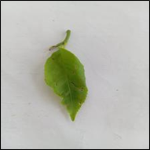
   

Results:

  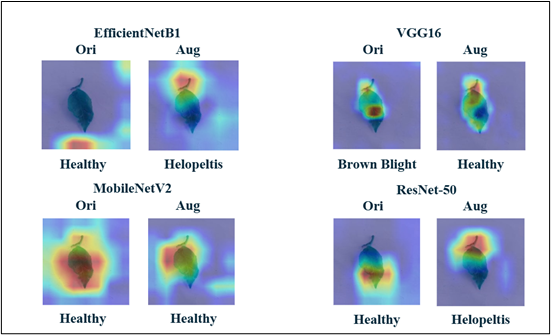
   

* Most standalone models failed to detect the disease because they were distracted by healthy green regions or background noise, with VGG-16 even misidentifying a healthy-looking area as Brown Blight.
* In contrast, EfficientNetB1 and ResNet-50 successfully identified the sample as Helopeltis; by utilizing image augmentation, these models were able to pinpoint the critical small brown or black spots near the leaf stem that other architectures missed.

#### Red Spider
Observation:
*  Caused by infestation of *Oligonychus coffeae*
*  Formation of red spot (Transition red-brown)
  
Original Image:

  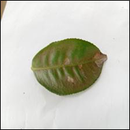
   

Results:

  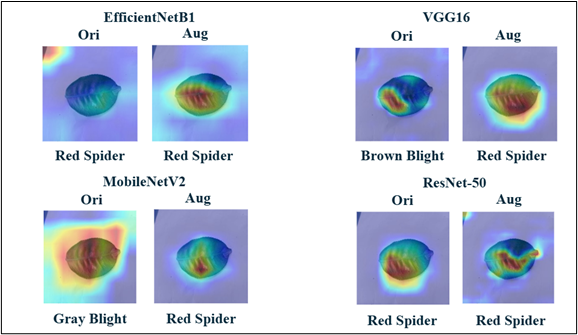
   

* Most standalone CNN models accurately diagnosed the Red Spider infestation by correctly isolating the lacerated marks on the lower portion of the leaf as the primary indicator.
* Some models struggled with visual similarities; VGG-16 confused the brown lacerated marks with Brown Blight lesions, while MobileNetV2 was misled by background noise, causing it to misidentify the sample as Grey Blight despite having localized the correct marks on the leaf.

#### Green Mirid Bug
Observation:
*  Caused by infestation of *Apolygus lucorum* and *Pachypeltis maesarum*
*  Discolouration, deformities, and necrosis on leaf surface
*  Appear brown or black spots
  
Original Image:

  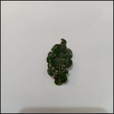
   

Results:

  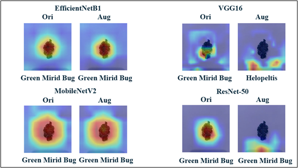
   

* Almost all standalone CNN models successfully identified the Green Mirid Bug symptoms, though VGG-16 failed when augmentation caused its attention to drift toward background noise, leading to an incorrect Helopeltis prediction.
* While **ResNet-50** managed to classify the sample correctly despite being distracted by the background, the results suggest that image augmentation can sometimes introduce unnecessary noise that misleads certain models during the decision-making process.

#### Healthy
Observation:
*  No sign of necrosis, bite of pest and lesion at the surface of tea leaf
*  Green colour

Original Image:

  
   

Results:

  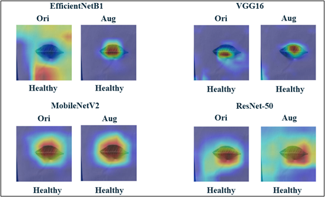
   

* All standalone CNN models successfully identified the healthy samples by correctly focusing on the greenish surface of the leaf body, demonstrating a strong ability to recognize healthy tissue.
* While some models (like the original **EfficientNetB1**) initially relied on background noise to reach the correct conclusion, image augmentation proved highly effective at redirecting the models' focus away from environmental noise and toward the actual leaf surface.

### Model Evaluation (Multiclass)

  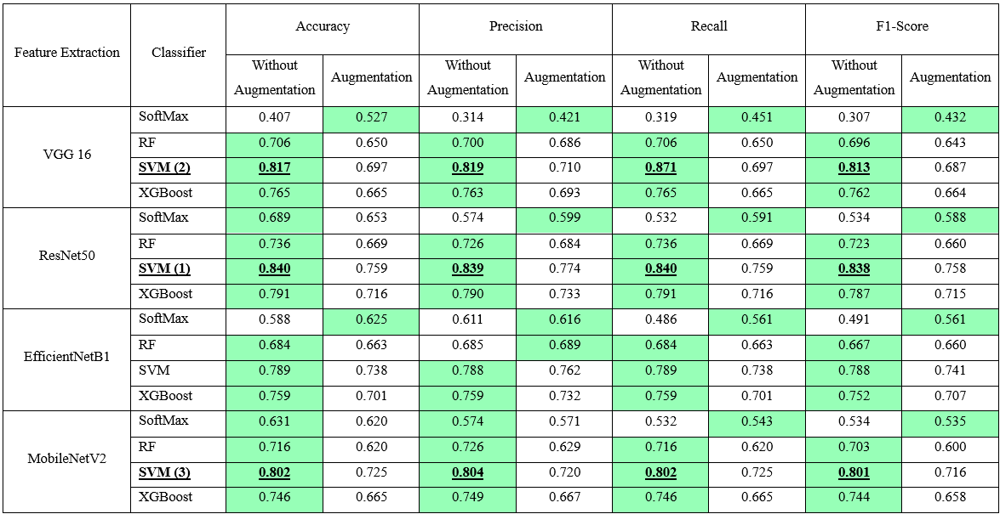

* Moving from binary to multiclass classification significantly increased complexity, as models had to localize a more diverse set of features. This led to a general drop in performance across the board compared to simpler binary tasks.
* Standalone CNNs performed poorly even with the help of augmentation, struggling to reach an F1-score above 0.588. In contrast, hybrid CNN-SVM models demonstrated far greater precision, achieving F1-scores up to 0.838 without needing any augmentation.
* By prioritizing the F1-score to handle data imbalance, the top three models identified were ***ResNet-50-SVM (0.838), VGG-16-SVM (0.813), and MobileNetV2-SVM (0.801)***. These models proved most effective when trained on original images, reinforcing that the hybrid approach is best for capturing intricate disease features.

## Conclusion

## Limitation
